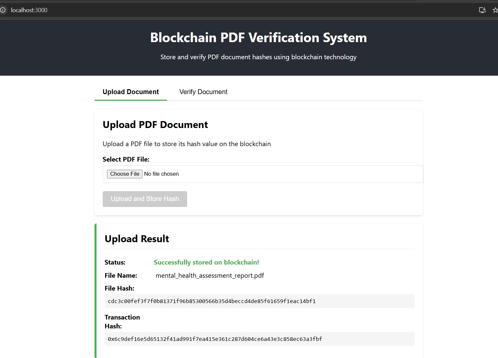
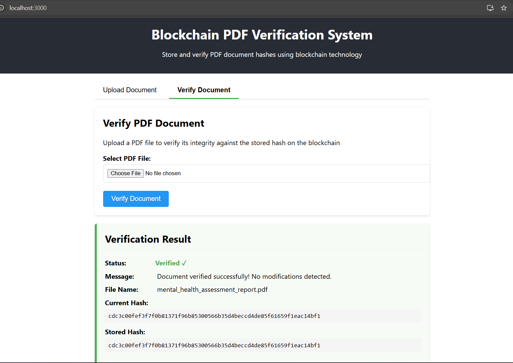
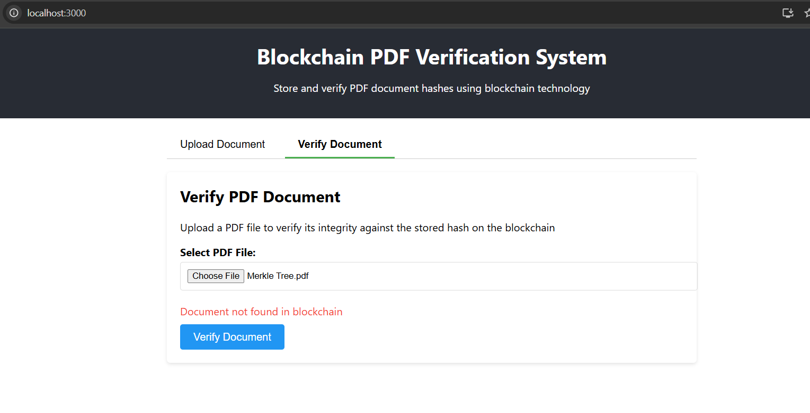

# 🔐 Blockchain PDF Verification System

A **full-stack decentralized application** to **securely store and verify PDF document integrity** using Ethereum blockchain technology and IPFS Desktop. With this system, tampering becomes instantly detectable and trust in your documents becomes rock-solid.

---

## 📚 Table of Contents

- [🚀 Overview](#-overview)
- [📁 Project Structure](#-project-structure)
- [✨ Features](#-features)
- [⚙️ Installation and Setup](#-installation-and-setup)
  - [▶️ Run Ganache CLI](#️-run-ganache-cli)
  - [🔧 Deploy Smart Contracts with Truffle](#-deploy-smart-contracts-with-truffle)
  - [🛠️ Setup the Backend](#️-setup-the-backend)
  - [🎨 Setup the Frontend](#-setup-the-frontend)
- [🧪 Usage](#-usage)
  - [📤 Uploading a PDF](#-uploading-a-pdf)
  - [✅ Verifying a PDF](#-verifying-a-pdf)
- [🖼️ Screenshots](#-screenshots)
- [🤝 Contributing](#-contributing)
- [📝 License](#-license)

---

## 🚀 Overview

The **Blockchain PDF Verification System** is built to:

- 🔐 **Securely store** PDF hashes on an Ethereum blockchain.
- 🧾 **Verify the integrity** of documents by comparing hashes.
- ⚠️ **Detect tampering** instantly.

**Architecture Overview:**

- 🖥️ **Backend:** Node.js + Express for PDF uploads, hashing, and blockchain interaction.
- 🧠 **Smart Contract:** Solidity contract deployed via Truffle to handle hash storage and retrieval.
- 🌐 **Frontend:** React.js UI for a clean, intuitive user experience.

---

## 📁 Project Structure

```plaintext
blockchain-pdf-verification/
├── backend/                 # Node.js + Express backend
│   ├── .env
│   ├── package.json
│   ├── server.js
│   └── contracts/
│       ├── DocumentVerification.sol
│       └── DocumentVerification.json
├── frontend/                # React.js frontend
│   ├── .env
│   ├── package.json
│   ├── public/
│   └── src/
│       ├── components/
│       │   ├── UploadForm.js
│       │   ├── VerifyForm.js
│       │   ├── ResultDisplay.js
└── truffle-contracts/       # Truffle smart contract setup
    ├── contracts/
    ├── migrations/
    ├── truffle-config.js
    └── build/
```

---

## ✨ Features

- 📄 **Immutable Document Records**: Store the SHA-256 hash of PDFs on the blockchain.
- 🕵️ **Integrity Check**: Instantly detect any alteration or tampering.
- ⚙️ **Smart Contract Powered**: Leverages Ethereum's decentralization.
- 👨‍💻 **Developer Friendly**: Easy to deploy, test, and extend.
- 🖥️ **Simple UI**: Clean React-based interface for both upload and verification.

---

## ⚙️ Installation and Setup

### ▶️ 1. Run Ganache CLI

Install Ganache CLI if you haven’t already:

```bash
npm install -g ganache-cli
```

Start a local Ethereum blockchain:

```bash
ganache-cli
```

### 🔧 2. Deploy Smart Contracts with Truffle

Navigate to the contracts directory:

```bash
cd blockchain-pdf-verification/truffle-contracts
```

Deploy the contract:

```bash
truffle migrate --reset --compile-all --network development
```

✔️ **Note:** Copy the deployed contract address from `DocumentVerification.json`.

### 🛠️ 3. Setup the Backend

```bash
cd blockchain-pdf-verification/backend
npm install
```

Update `.env` with your details:

```env
PORT=5000
ETHEREUM_PROVIDER=http://localhost:8545
CONTRACT_ADDRESS=0xYOUR_CONTRACT_ADDRESS
ETHEREUM_ACCOUNT=0xYOUR_ACCOUNT
ETHEREUM_PRIVATE_KEY=0xYOUR_PRIVATE_KEY
```

Start the backend:

```bash
npm run dev
```

### 🎨 4. Setup the Frontend

```bash
cd blockchain-pdf-verification/frontend
npm install
```

Configure API URL:

```env
REACT_APP_API_URL=http://localhost:5000
```

Launch the React app:

```bash
npm start
```

---

## 🧪 Usage

### 📤 Uploading a PDF

1. Navigate to **Upload Document**.
2. Select your PDF file.
3. Click **Upload and Store Hash**.
4. View blockchain transaction details including:
   - File name
   - Document hash
   - Transaction hash

### ✅ Verifying a PDF

1. Switch to the **Verify Document** tab.
2. Upload your PDF file.
3. Click **Verify Document**.
4. Get results instantly:
   - ✅ **Verified:** Document is untampered.
   - ❌ **Not Verified:** The document has been modified.

---

## 🖼️ Screenshots

| Action | Preview |
|-------|---------|
| 📝 **Document Stored** |  |
| 🔍 **Verified Successfully** |  |
| 🚨 **Tampering Detected** |  |

---

### ✨ Features

- 🌐 **IPFS Integration**: All uploaded PDF files are stored on **IPFS (InterPlanetary File System)**, ensuring decentralized, persistent file storage. This makes the system more **reliable**, **tamper-proof**, and **globally accessible**.

---

### 🧩 5. Setup IPFS Desktop (Windows)

> 💡 IPFS (InterPlanetary File System) enables decentralized storage of documents — perfect for ensuring long-term, reliable access to uploaded files beyond just hash verification.

#### 🔽 Step 1: Download and Install

1. Visit the official IPFS Desktop release page:  
   👉 [https://github.com/ipfs/ipfs-desktop/releases](https://github.com/ipfs/ipfs-desktop/releases)

2. Download the `.exe` file for **Windows**.

3. Run the installer and follow the prompts to install IPFS Desktop.

#### 🔁 Step 2: Keep IPFS Running

- After launching, **IPFS Desktop** will run in the system tray.
- Ensure it's always **open** while using the app to allow files to be added and pinned to your local IPFS node.

#### 🔐 Step 3: View or Download PDF Reports via IPFS

- After uploading a PDF, your file is stored in IPFS, and the app will return an **IPFS CID** (Content Identifier).
- To **view or download** your document:

```text
https://ipfs.io/ipfs/<your-cid-hash>
```

➡️ Example:

```text
https://ipfs.io/ipfs/QmXyz12345Abc...
```

- Paste this link into your browser to **securely preview or download** the PDF directly from the **IPFS public gateway**.

---

## 🤝 Contributing

We welcome contributions of all kinds — code, documentation, ideas, or feedback!

```bash
# Steps to contribute
1. Fork this repository
2. Create a new branch (`git checkout -b feature-xyz`)
3. Commit your changes (`git commit -m 'Add feature xyz'`)
4. Push to your fork (`git push origin feature-xyz`)
5. Open a pull request 🚀
```

---

## 📝 License

Licensed under the **MIT License**.  
See [LICENSE](./LICENSE) for more details.

---

💬 _Enjoy building secure, decentralized apps! For questions, feedback, or just to say hi — don't hesitate to reach out._  
---